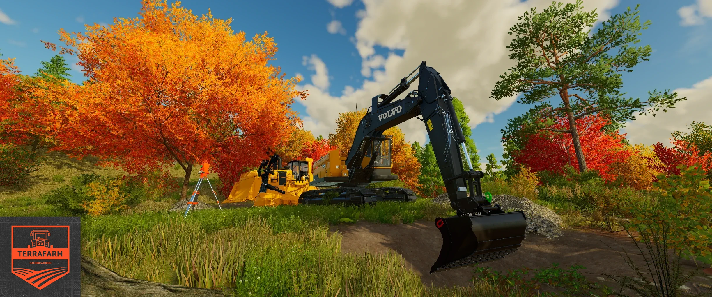

# TerraFarm - Machines Addon

This mod adds support for 3rd. party equipment.

Feel free to use this as base for your own configuration mod.

**Requires [TerraFarm](https://github.com/scfmod/FS25_TerraFarm) 0.9.0.0 or later installed**

## How to download and install

Download the latest [```FS25_0_TerraFarmMachines.zip```](https://github.com/scfmod/FS25_TerraFarmMachines/releases/latest/download/FS25_0_TerraFarmMachines.zip) and copy/move it into your FS25 mods folder.

## List of supported equipment

### Modhub

```
Excavator Attachments
Excavator Tool Pack
Fiat-Allis Ad9
JCB 714
JCB Backhoe Loader
JCB Hydradig 110W
Volvo Pack - DR631
Volvo Pack - LM841 Rock Shovel
Volvo Pack - LM841 Shovel
```

### Other

```
ACM Cat D11 NG
Case CX35B
Doosan DX225LC
D6T2
D6T2U
JD135C
JohnDeere 650K
Gjerstad Pack
T-130
```

Read the full mod list [here](./MODS.md).

